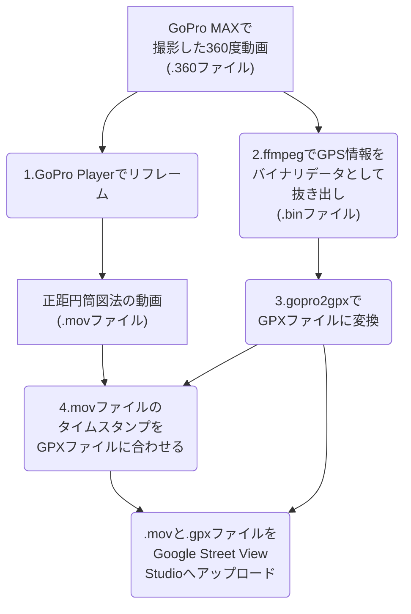

# はじめに

今回はGoPro MAXで撮影した360度動画をGoogle Street View Studioへアップロードする方法について解説します。

# 作業の流れ



# 1. GoPro Playerでリフレーム
[GoPro Player](https://gopro.com/ja/jp/info/gopro-player)で`.360`ファイルをリフレーム(エンコード)により正距円筒図法の動画(Equirectangular Movie, 拡張子は`.mov`)に変換します。変換設定は以下のとおりです。
- 解像度：`5.6K`
- コーデック：`HEVC`
- 画質：高
- ワールドロック：無効化
- 水平レベル：無効化

最後の2つは、[こちら](https://support.google.com/maps/answer/7662671?hl=ja&ref_topic=6275604&sjid=5251716638368403376-AP)に書かれている`ジャイロスコープスタビライザーを無効にします`に対応する設定です。

# 2. ffmpegでGPS情報をバイナリデータとして抜き出し
[ffmpeg](https://www.ffmpeg.org/download.html)で`.360`ファイルからGPS情報が含まれているStreamを抜き出します。

@[card](https://www.ffmpeg.org/download.html)

まず、Streamの情報を確認します。
```bash
ffprobe PATH_TO_VIDEO
```

`handler_name`が`GoPro MET`になっているStreamを抜き出します。今回対象としているファイルですと以下のような出力が出てきているStreamです。

```bash
Stream #0:3[0x4](eng): Data: bin_data (gpmd / 0x646D7067), 93 kb/s (default)
    Metadata:
    creation_time   : 2024-01-01T01:23:45.000000Z
    handler_name    : GoPro MET
```

ここで、`Stream #0:3`が対象のStreamです。このStreamを`ffmpeg`の`-map`オプションを使って抜き出します。

```bash
ffmpeg -y -i PATH_TO_VIDEO -codec copy -map 0:3 -f rawvideo PATH_TO_BIN/BIN_NAME.bin
```

このようにすると、バイナリデータファイル`BIN_NAME.bin`が生成されます。

:::message
本当は次のステップで使う`gopro2gpx`において、動画ファイルから直接`GPX`ファイルが生成できるはずなのですが、当方の環境では以下のエラーが出てしまい、うまくいきませんでした。そのため、一旦バイナリデータとして抜き出し、それを`GPX`ファイルに変換する手法を取っています。

```bash
-- stats -----------------
Device: Unknown
- Ok:                  0
- GPSFIX=0 (bad):      0 (skipped: 0)
- GPSP>2000 (bad):     0 (skipped: 0)
- Empty (No data):     0
Total points:          0
--------------------------
Can't create file. No GPS info in []. Exitting
```
:::

# 3. gopro2gpxでGPXファイルに変換

`gopro2gpx`というツールを使って、バイナリデータファイルを`GPX`ファイルに変換します。

@[card](https://github.com/juanmcasillas/gopro2gpx)

```bash
gopro2gpx -vvv -b -s PATH_TO_BIN/BIN_NAME.bin PATH_TO_GPX/GPX_NAME
```

ここで`-vvv`はverboseモードで、`v`の数が多いほど詳細なログが出力されます。指定可能なのは`-v`から`-vvv`までです。また、`-b`はバイナリデータファイルを読み込む引数で、`-s`は`GPSFIX`が0の点を除く引数です。

また`GPX_NAME`は出力される`GPX`ファイルの名前で、拡張子は不要です。

このコマンドを実行すると、`GPX_NAME.gpx`ファイルと`GPX_NAME.kml`ファイルが生成されます。

# 4. `.mov`ファイルのタイムスタンプを`GPX`ファイルに合わせる

1で生成された`.mov`ファイルのタイムスタンプは、撮影時刻ではなくリフレーム(エンコード)時刻になっています。一方`.gpx`ファイルは撮影時刻を記録しているため、`.mov`ファイルのタイムスタンプと`.gpx`ファイルのタイムスタンプを合わせる必要があります。

まず、`.gpx`ファイルのタイムスタンプを確認します。色々な方法があるかと思いますが、今回は`Get-Content`コマンドを使って確認します。

```bash
$XML = [XML](Get-Content PATH_TO_GPX/GPX_NAME.gpx)
$XML.gpx.trk.trkseg.trkpt.time[0]
```

これによって、`.gpx`ファイルの中にある最初の`time`タグの中身が表示されます。
```bash
2024-01-01T01:23:45.000Z
```

:::message
ここで出力される時刻は世界標準時(UTC)です。日本時間ではありません。
:::

ここで表示された時刻を使って、`.mov`ファイルのタイムスタンプを変更します。ここでも様々なやり方があるかと思いますが、今回は`exiftool`を使って変更します。

@[card](https://exiftool.org/)

```bash
exiftool.exe -TrackCreateDate="2024:01:01 01:23:45" -overwrite_original PATH_TO_VIDEO
```

これによって、`.mov`ファイルのタイムスタンプが変更されます。

:::message
色々試したところ、`Street View Studio`へのアップロード時に`gpx`ファイルとのタイムスタンプの整合性チェックに使用されているのは`TrackCreateDate`のようです。しかし、これでもエラーが出ることも考えられるため、他のタイムスタンプも変更しておく必要があるかもしれません。

```bash
exiftool.exe -TrackCreateDate="2024:01:01 01:23:45" -CreateDate="2024:01:01 01:23:45" -ModifyDate="2024:01:01 01:23:45" -GPSDateTime="2024:01:01 01:23:45" -MediaCreateDate="2024:01:01 01:23:45" -MediaModifyDate="2024:01:01 01:23:45" -TrackModifyDate="2024:01:01 01:23:45" -GPSDateStamp="2024:01:01" -GPSTimeStamp="01:23:45" -overwrite_original PATH_TO_VIDEO
```
:::

# 5. `.mov`と`.gpx`ファイルをGoogle Street View Studioへアップロード
最後に、`.mov`ファイルと`.gpx`ファイルを[Google Street View Studio](https://www.google.com/streetview/publish/)へアップロードします。アップロード後、`Street View`として公開されるまでしばらく時間がかかります。