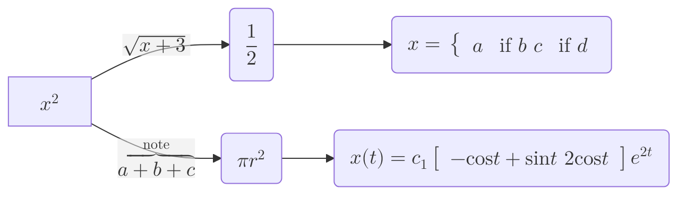

# Mermaid中 数式テスト

```mermaid
 graph LR
      A["$$x^2$$"] -->|"$$\sqrt{x+3}$$"| B("$$\frac{1}{2}$$")
      A -->|"$$\overbrace{a+b+c}^{\text{note}}$$"| C("$$\pi r^2$$")
      B --> D("$$x = \begin{cases} a &\text{if } b \\ c &\text{if } d \end{cases}$$")
      C --> E("$$x(t)=c_1\begin{bmatrix}-\cos{t}+\sin{t}\\ 2\cos{t} \end{bmatrix}e^{2t}$$")

```