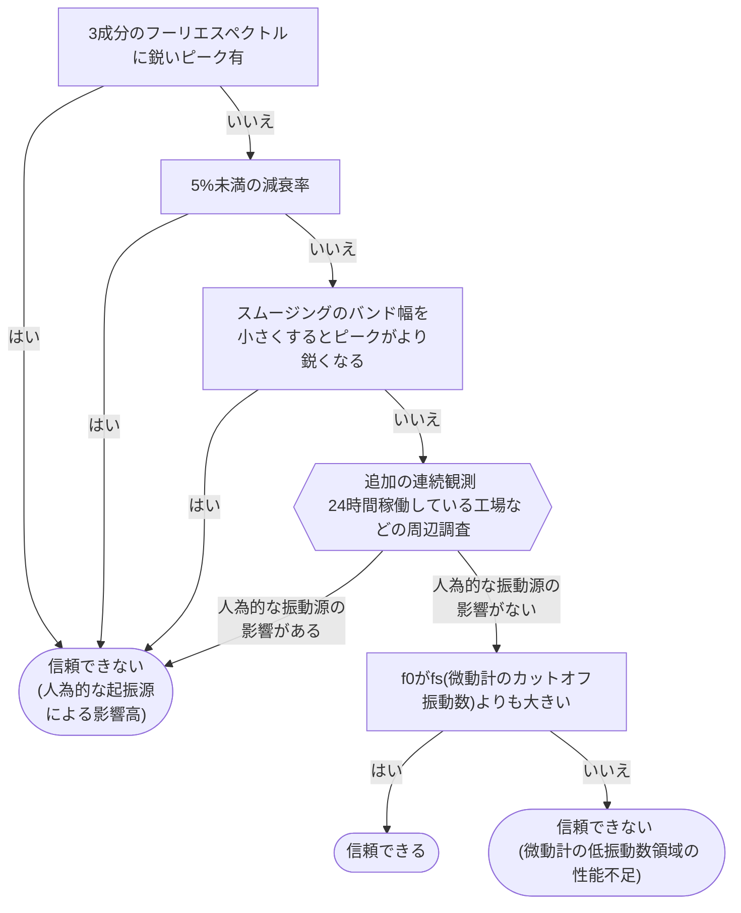
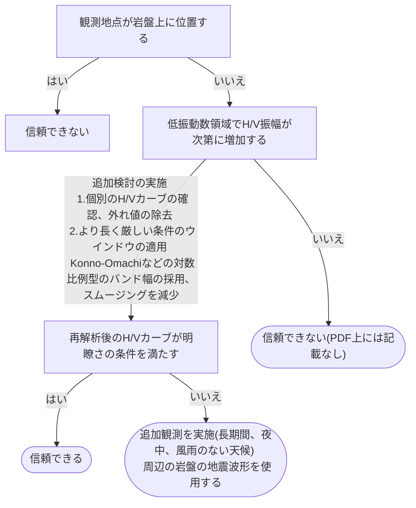
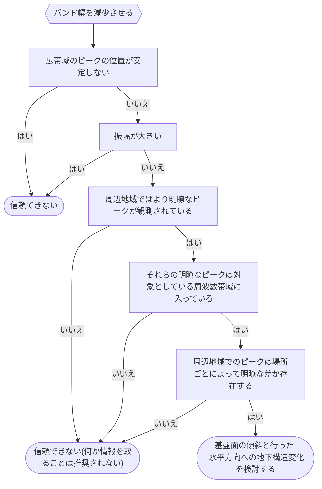
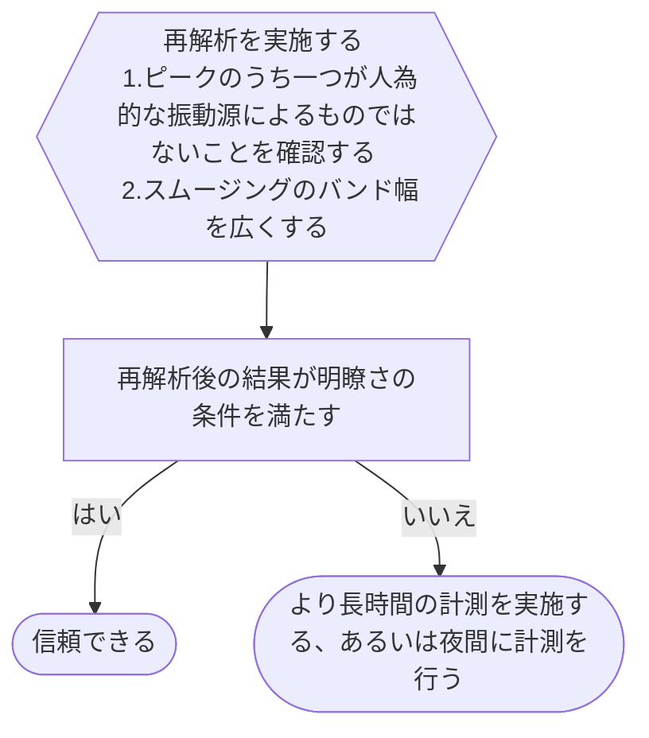
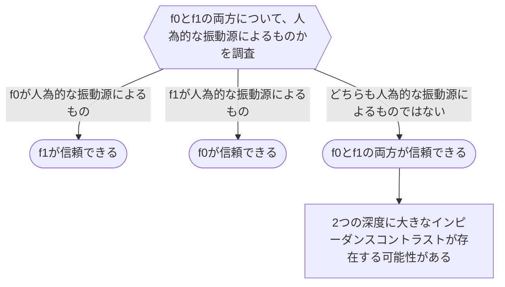
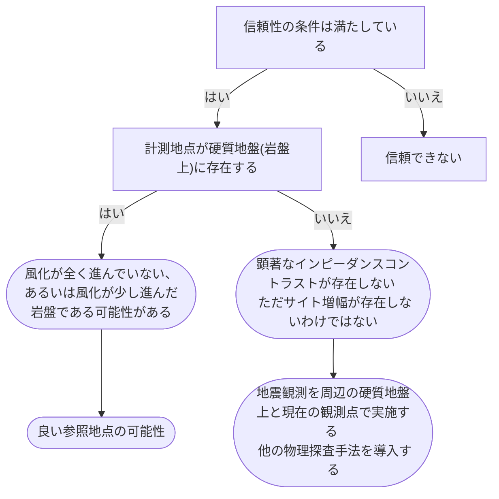

# ピークのタイプ

SESAME Guidelineでは、H/V曲線のピークをいくつかのタイプに分類しています。全てのピークが必ずしも地盤特性を反映しているとは限らず、人為的なノイズや波形の前処理方法に起因するものもあり、早急な決定は避けるべきです。ここではピークをいくつかのタイプに分類し、その成因と解釈、追加処理の方法について記述していきます。

SESAME Guilelineに記載されているピークのタイプは以下の通りです。

1. **鋭いピーク**
1. **明瞭なピーク**
1. **低振動数帯に存在する不明瞭なピーク**
1. **背の低い広帯域なピーク**
1. **複数のピーク**
1. **2つのピーク**
1. **フラットなH/V曲線**

## 1.鋭いピークと2.明瞭なピーク

鋭いピークや明瞭なピークは、レイリー波楕円率の基本的な形状であり、地盤の特性を反映している可能性が高いです。しかし、人為的な振動源による影響がある場合、ピークの信頼性が低下することがあります。そのため、ピークの信頼性を確認するためには、以下のような手順を踏むことが推奨されています。

基本的には、人為的な振動源であるかを確認し、かつ$f_0$が微動計のカットオフ振動数よりも大きいかを確認することで、ピークの信頼性を判断することができます。

## 3.低振動数帯に存在する不明瞭なピーク

低振動数帯に存在するピークは、より深い地盤のインピーダンスコントラストを示している可能性があります。しかし、観測点が岩盤上に位置する場合には、そうしたコントラストが生じる可能性が低いため、信頼性は低くなります。また、低振動数領域は微動計の性能が低下する場合があるため、ハズレ値の除去やスムージング手法を見直すことによって、最初に得られたカーブが明瞭さを満たすのかを十分に検討する必要があります。

## 4. 背の低い広帯域なピーク

## 5. 複数のピーク

## 6. 2つのピーク

ここでは、2つのピークの振動数をそれぞれ$f_0$, $f_1$とし、$f_0 < f_1$とします。

## 7. フラットなH/V曲線
